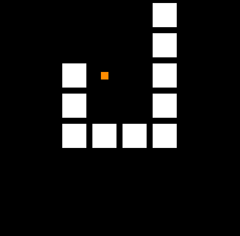

# Snake

This is a basic Snake implementation with PyGame.

## Features
* control snake movement with WASD
* collect fruits, each fruits extends the length of your snake by 1
* if snake collides with borders or itself, it`s game over

### Features software development
* event driven design: decorators
* game loop
* basic drawing of geometry
* state machine  
* object orientation, inheritance

## Known issues

